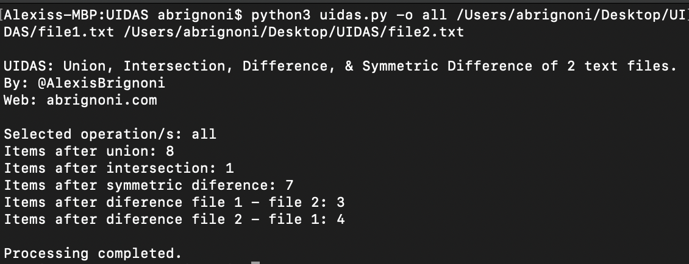
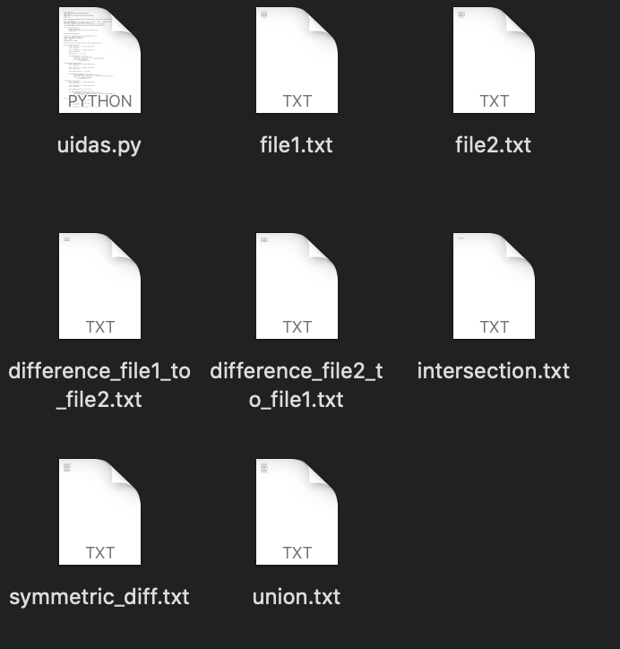

# UIDAS
Union, Intersection, Difference, and Symmetric Difference of the per line content of two text files.

Script will take 2 provided text files and provided the Union, Intersection, Difference, and Symmetric Difference of all line items per Python methods as stated here: https://docs.python.org/2/library/sets.html

Quick summary of methods where x = file1 and y = file2:
* Union = Return a set that contains all items from both sets, duplicates are excluded.
* Symmetric Difference = Return a set that contains all items from both sets, except items that are present in both sets.
* Difference = Return a set that contains the items that only exist in set x, and not in set y.
* Intersection = Return a set that contains the items that exist in both set x, and set y.

The script will place the resulting sets in txt files.

